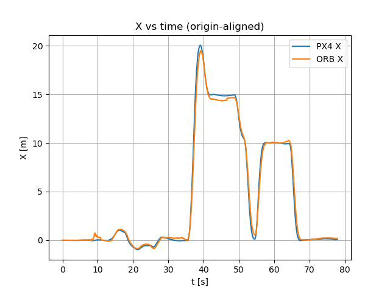

# GNSS-Denied PX4 State Estimation with Monocular-Inertial ORB-SLAM3 (ROS 2 + Gazebo)
This repository contains an end-to-end **simulation** pipeline that runs **ORB-SLAM3** in **IMU_MONOCULAR** mode on a PX4 Gazebo camera/IMU stream and feeds the resulting motion estimate into **PX4 EKF2** as **External Vision** (no GNSS aiding for horizontal navigation).

**High-level dataflow**

`PX4 SITL + Gazebo sensors → ROS-Gazebo bridge → Python live driver (handshake) → ORB-SLAM3 C++ node → EV bridge (ENU→NED + yaw align + velocity) → PX4 EKF2`

---

## What this project demonstrates

- Live **Gazebo monocular camera + IMU** driving ORB-SLAM3 through a ROS 2 wrapper that uses a **Python↔C++ handshake** before starting the image stream.
- Robust **IMU buffering + synchronization** (monotonic timestamps, minimum IMU samples per frame, commit/rollback buffer consumption).
- ROS 2 **QoS** tuned for estimator stability (**IMU RELIABLE**, images can be **BEST_EFFORT**).
- Export of SLAM pose as a ROS 2 topic (`/orb_slam3/pose`) for logging/visualization and downstream fusion.
- External Vision publishing to PX4 (`/fmu/in/vehicle_visual_odometry`) with:
  - **ENU → NED** conversion
  - **yaw gauge alignment** using PX4 attitude as a local reference
  - **finite-difference horizontal velocity** to keep `v_xy_valid` in OFFBOARD

---

## Repository layout (typical)

- `ros2_orb_slam3/`  
  ORB-SLAM3 ROS 2 wrapper (C++ node). Expects the handshake topics and loads the selected YAML config.
- `px4_orbslam_bridge/`  
  Custom integration nodes:
  - `gz_orbslam_driver`: subscribes to Gazebo-bridged camera/IMU topics and republishes them to the wrapper’s expected topics (with handshake gating for images)
  - `vio_to_px4` (name may differ): converts ORB/VIO pose into PX4 `VehicleOdometry` with frame conversion, yaw alignment, velocity, and reset handling

---

## Demo video

- **Video (MP4):**
 <video width="720" controls>
  <source src="https://raw.githack.com/jacopodallafior/VIO_SLAM_without_GPS_using_PX4_and_ORBSLAM3/blob/main/media/demo.mp4" type="video/mp4">
</video>

---

## Results (PX4 vs ORB/VIO)

The plots below compare the aligned VIO output against PX4 local position (origin-aligned for readability).

### Y vs time

### X vs time

### XY trajectory

---

## Quickstart (simulation)

### Prerequisites
- Ubuntu + **ROS 2 Humble**
- **PX4 SITL** + **Gazebo (gz-sim)**
- `ros_gz_bridge` (or `ros_gz_ws` source build)
- ORB-SLAM3 dependencies (OpenCV, Eigen, Pangolin, etc.)

### 1) Start PX4 SITL + Gazebo
Launch your PX4 vehicle in the Gazebo world that contains the monocular camera + IMU sensors.

### 2) Bridge Gazebo camera topics to ROS 2
Bridge the Gazebo image and camera_info topics into ROS 2 (`sensor_msgs/Image` and `sensor_msgs/CameraInfo`).

### 3) Start ORB-SLAM3 C++ node
Run the wrapper node (it will wait for the experiment configuration string on the handshake topic).

### 4) Start the live driver (handshake + forwarding)
Run `gz_orbslam_driver` with:
- `config_name`: selects the ORB-SLAM3 YAML file (e.g., `GZ_x500`)
- `image_in_topic`: the bridged image topic from Gazebo
- `imu_in_topic`: the bridged IMU topic from Gazebo

The driver:
- repeatedly publishes `config_name` until it receives **ACK**
- forwards **IMU immediately**
- forwards **images only after ACK** (prevents null-pointer race before ORB-SLAM3 initialization)

### 5) Publish External Vision to PX4
Run the EV bridge that:
- reads `/orb_slam3/pose`
- converts ENU→NED
- aligns yaw to PX4
- computes horizontal velocity
- publishes `px4_msgs/VehicleOdometry` to `/fmu/in/vehicle_visual_odometry`

---

## PX4 EKF2 configuration (GNSS-denied horizontal)

A minimal working setup used in this project:

- `EKF2_EV_CTRL = 5` (fuse EV position + velocity)
- `EKF2_GPS_CTRL = 0` (disable GNSS aiding)
- `COM_ARM_WO_GPS = 1` (allow arming without GPS)
- `EKF2_EV_DELAY` tuned to your pipeline latency

Notes:
- This setup typically keeps **baro** as the height reference (don’t fuse EV z unless you’ve validated it).
- If EV gets rejected, relax gating and verify timestamps and frame conventions first.

---

## Notes on frames and yaw

- ORB-SLAM3 pose is produced in a local “map” frame (ROS-style ENU).
- PX4 local navigation uses NED.
- Absolute yaw is not observable in pure monocular-inertial without an external reference, so this project uses a **constant yaw offset** computed from PX4 attitude once tracking is stable.

---

## Troubleshooting checklist

- **SLAM window opens but no trajectory:** the camera must move (parallax needed), and intrinsics must match `CameraInfo`.
- **Intermittent inertial assertions/crashes:** ensure IMU is **RELIABLE**, timestamps are monotonic, and each image has sufficient IMU coverage.
- **EKF2 rejects EV:** verify `timestamp_sample`, delay parameter, and that you’re publishing consistent NED frames and units (meters, m/s).

---

## References

- ORB-SLAM3: Campos et al., *IEEE Transactions on Robotics*, 2021.
- PX4 External Vision / EKF2 documentation.

---
### License
Choose a license (e.g., MIT/BSD/Apache-2.0) and add a `LICENSE` file.
""")
